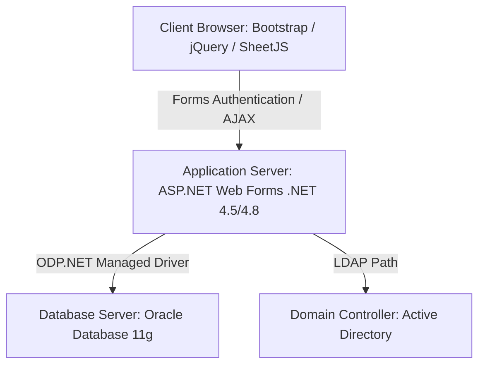
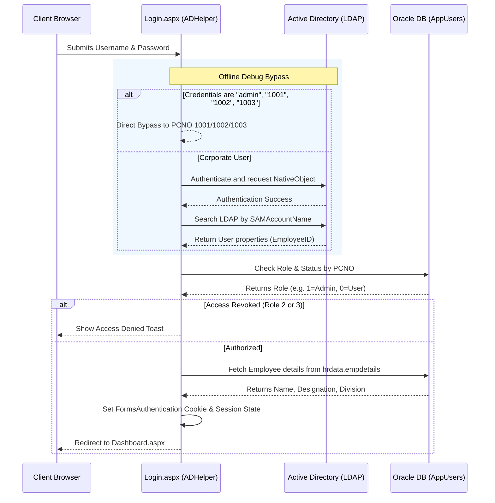

# Attendance & Document Management System
## Technical Architecture, Schema, and Capabilities Report (For Team Lead)

---

## 1. Executive Summary

The **Attendance and Document Management System** is a secure, intranet-hosted web application built to streamline contract employee lifecycle management, daily attendance logging, wage calculations, and administrative document generation. 

Designed specifically for **safe, air-gapped corporate intranet networks**, the application has **zero internet dependencies** and integrates with local corporate systems (Active Directory via LDAP and Oracle Database 11g). It provides high-speed, thread-safe database operations, robust audit logging, and client-side exporting tools to generate Microsoft Word and Excel files.

---

## 2. Technology Stack & Architecture

The project is structured as a **Three-Tier Architecture** deploying inside standard local IIS Web Servers:



### 2.1 Backend Core
*   **Framework**: ASP.NET Web Forms (.NET Framework 4.5/4.8) written in C#.
*   **Database Driver**: ODP.NET Managed Driver (`Oracle.ManagedDataAccess.dll`). This 100% managed driver eliminates the need for installing Oracle Client Homes or configuring registry entries on the hosting IIS server, simplifying deployments.
*   **Authentication Mode**: Forms-based authentication integrated with Windows Active Directory.

### 2.2 Frontend Layer
*   **Structure**: MasterPage (`Site.Master`) utilizing standard responsive layouts.
*   **Libraries (No external CDN dependencies - 100% Offline)**:
    *   **jQuery 3.6.0**: Manages AJAX WebMethod interactions.
    *   **SheetJS (xlsx.full.min.js)**: Handles client-side, styled Excel workbook compilation.
    *   **FontAwesome 5**: Vector icons.
    *   **Bootstrap 4**: Styles, grids, and responsive components.
    *   **SweetAlert2**: Styled popup modals and toasts.

---

## 3. Database Schema Design & Seed Setup

The database is built on **Oracle 11g**. It employs sequence generators and before-insert triggers to simulate auto-increment IDs, as Oracle 11g does not natively support the `IDENTITY` column syntax.

### 3.1 Key Tables Overview
The schema contains 20+ tables managing divisions, contracts, worker stints, attendance logs, templates, and audit trails. Below is a structured breakdown:

| Table Name | Primary Key | Foreign Keys / Constraints | Description |
| :--- | :--- | :--- | :--- |
| `hrdata.empdetails` | `PCNO` | None | Corporate database simulation. Stores corporate employees (PCNO, Name, Designation, Division Name) utilized for login verification. |
| `AppUsers` | `PCNO` | Role CHECK (0=User, 1=Admin, 2=Revoked Admin, 3=Revoked User) | Registered application login credentials and system roles. |
| `Divisions` | `Id` | `Name` (UNIQUE) | Organizational divisions. |
| `Categories` | `Id` | `Name` (UNIQUE) | Worker skill categorizations (e.g., Skilled, Semi-Skilled, Unskilled). |
| `UserDivisions` | `(PCNO, DivisionName)` | FKs to `AppUsers` & `Divisions` | Role mapping. Defines which divisions regular users are authorized to view and manage. |
| `Vendors` | `Id` | `MasterId` (UNIQUE), `Name` (UNIQUE) | External contractor/manpower agencies. |
| `ContractPeriods` | `Id` | FK to `Categories`, `Vendors`. UNIQUE `(Category, StartDate)` | Operational contracts between vendor agencies and categories. |
| `ContractExtensions`| `Id` | FK to `ContractPeriods` | Historical log of contract date extensions. |
| `Employees` | `MasterId` | FK to `Divisions`, `EmployeeEngagements` (deferred) | Worker master data. Tracks status, leave balances, qualification, and cumulative experience. |
| `EmployeeEngagements`| `Id` | FK to `Employees`, `ContractPeriods`, `Vendors` | Stints of workers. Tracks when an employee worked for a specific contractor and category. |
| `EmployeeLeaveCredits`| `Id` | FK to `Employees`, `ContractPeriods` | Date-specific leaves credited to a worker. |
| `Attendance` | `Id` | FK to `Employees`, `EmployeeEngagements`, `ContractPeriods`. UNIQUE `(EmpID, Year, Month, Day)` | Daily attendance values (0=Absent, 1=Present, 2=Paid Leave, 3=Unpaid Leave). |
| `CalculationWages` | `(Year, Month, Category)` | None | Base wages assigned for payroll calculations per month. |
| `CalculationOverrides`| `(Year, Month, Category, EmpID)`| FK to `Employees`, `EmployeeEngagements`, `ContractPeriods` | Manual administrative overrides of final payable days. |
| `AttendanceRemarks` | `Id` | None | Correction requests sent from regular users to administrators. |
| `CertificateTemplates`| `TemplateKey` | None | Editable template text strings for Word/Excel certificates. |
| `ActionLog`, `AdminActionLog`, `EmployeeActionLogs` | `Id` | `PreState` (CLOB), `PostState` (CLOB) | Audit logging tables storing pre- and post-modification states of database entities. |
| `Attendance_Audit_Log`| `Id` | None | Specific log capturing every manual change to a worker's daily attendance. |

### 3.2 Thread-Safe Automatic Contract Closures
In [DBHelper.cs](file:///e:/attendence/Utils/DBHelper.cs), a thread-safe check triggers **every 5 seconds** upon database query executions:
1. It queries `ContractPeriods` with an active status whose end dates have passed.
2. It changes the status to `Closed`.
3. It closes all active `EmployeeEngagements` under that period, setting `EndReason = 'ContractEnd'`.
4. It sets the employee master record `CurrentEngagementId = NULL` and status to `'ContractEnded'`.
5. These operations run under a consolidated `OracleTransaction` wrapper, keeping data consistent.

---

## 4. Security & Authentication Flow

Access to the system is governed by corporate Windows accounts with local configurations for standalone operations.



### 4.1 LDAP Authentication Details (`ADHelper.cs`)
*   **Directory Entry Binding**: Uses standard connection strings from `Web.config`:
    `<add key="ADConnectionPath" value="LDAP://192.168.0.105/DC=ad01,DC=yajnesh,DC=com" />`
*   **User Validation**: Calls `new DirectoryEntry(ldapPath, username, password)` and requests the `NativeObject` property to trigger credential validation against the Domain Controller.
*   **Employee ID Mapping**: Executes a query using `DirectorySearcher` filtered on `(SAMAccountName=username)` and extracts the `EmployeeID` property (mapping it as the user's PCNO).
*   **Local Developer Bypass**: For offline testing, usernames `'1001'`, `'admin'`, `'aadmin'` auto-bypass LDAP checking and return `PCNO = '1001'` (Admin) to allow database configuration without local Domain Controller setups.

---

## 5. Daily Attendance Rules & Calculations

The system computes worker attendance records under business constraints:

### 5.1 Saturday Cut Rule
*   Contract employees are expected to work standard work weeks. If an employee is absent on adjacent working days around a Saturday, the system marks the Saturday as an **Auto-Saturday Cut** (`AutoSat = 1`), reducing the payable days.
*   Administrators can override this cut by right-clicking on the calendar cell in the Attendance view, modifying the day's status, and adding a justification reason (e.g., medical leave), which disables `AutoSat` for that entry.

### 5.2 Half-Day Pairing
*   When workers request half-day leaves, they are logged with a value of `0.5` in the database.
*   To resolve payable cycles, the system pairs these half-day entries chronologically. Once two half-day entries are paired within a contract period, the system updates the remarks to indicate: `"2 half days: DD-MMM & DD-MMM"` and credits them as paired paid/unpaid leaves in the monthly reports.

---

## 6. Administrative Document Generation Hub (`Documents.aspx`)

The Document Hub consolidates monthly vendor reports into three core templates, reducing template editing times from hours to seconds.

```
+-----------------------------------------------------------------------------------+
|                                  DOCUMENT HUB                                     |
|  [ Attendance Certificate ]    [ Satisfactory Certificate ]   [ Covering Letter ]  |
+-----------------------------------------------------------------------------------+
|  - Select Year, Month, Category (Skilled, Semi-Skilled, Unskilled)                |
|  - Load data directly from Oracle DB                                              |
|  - Customize sentence templates with dynamic placeholders (saved globally)       |
|  - Direct interactive table previews (with column visibility checkboxes)         |
|  - Interactive print styles, Microsoft Word exports, and custom styled Excel files|
+-----------------------------------------------------------------------------------+
```

### 6.1 Generated Document Types
1.  **Attendance Certificate**: Tabulates monthly attendance data for contractor categories (e.g., Skilled, Semi-Skilled) showing ID, Name, Total Payable Days, Paid Leaves, Unpaid Leaves, Saturday cuts, and remarks.
2.  **Satisfactory Certificate**: Performance certificate verifying that a contractor provided outsource services satisfactorily w.e.f. a contract date, including employee counts, custom signatories, and customizable header images.
3.  **Covering Letter**: Prepares transmittal letters sent to finance and purchase departments to authorize monthly contractor payments, complete with phone, subject, body, reference number formats, and recipient blocks.

### 6.2 Text Template Customization
Text blocks are customizable via the UI and saved in the `CertificateTemplates` table. They replace dynamic placeholders in real-time on the browser:

```
Available placeholders:
- {VendorName}     -> VISHAL MANPOWER & SECURITY CONSULTANTS
- {VendorAddress}  -> Mangalore
- {Category}       -> Skilled
- {ContractNo}     -> GEMC-511687761569464
- {ContractDate}   -> 17-Oct-2025
- {StartDate}      -> 01-May-2026
- {EndDate}        -> 31-May-2026
- {EmpCount}       -> 12
- {Services}       -> Human Resource Outsourcing Services
```

---

## 7. Word & Excel Export Mechanics

The application generates files without server-side library dependencies (like Microsoft Interop or OpenXML), making it fast and lightweight.

### 7.1 Word Export (`.doc` Generation)
To export the Covering Letter and Satisfactory Certificate to Microsoft Word:
1.  The client script retrieves the styled HTML from the preview area (`#satisfactoryPrintSheet` or `#coveringLetterPrintSheet`).
2.  It constructs an HTML document using Microsoft-specific XML namespaces and Word metadata:
    ```html
    <html xmlns:o="urn:schemas-microsoft-com:office:office" 
          xmlns:w="urn:schemas-microsoft-com:office:word" 
          xmlns="http://www.w3.org/TR/REC-html40">
    <head>
      <meta name="ProgId" content="Word.Document"/>
      <!--[if gte mso 9]><xml><w:WordDocument><w:View>Print</w:View></w:WordDocument></xml><![endif]-->
      <style>
        @page Section1 { size: 595.3pt 841.9pt; margin: 72pt; }
        div.Section1 { page: Section1; }
        body { font-family: Arial, sans-serif; font-size: 12.0pt; }
        p { margin: 0; padding: 0; }
      </style>
    </head>
    <body><div class="Section1">...</div></body>
    </html>
    ```
3.  Paragraph variables are rendered using `.innerHTML.trim()` to ensure they are on a single line in Microsoft Word, avoiding styling indents or margins.
4.  The string is converted into a client-side `Blob` with type `application/msword` and a UTF-8 BOM (`\ufeff`). A click is simulated on a temporary `<a>` element to download the file directly in the user's browser.

### 7.2 Excel Export (SheetJS Generation)
To export the Attendance Certificate:
1.  The script queries the DOM table `#certTable` and filters out columns hidden by the user (e.g. Master ID).
2.  It builds an Array-of-Arrays (AOA) with:
    *   Row 1: Document Title (Merged across columns)
    *   Row 2: Description sentence 1 (Merged)
    *   Row 3: Description sentence 2 (Merged)
    *   Row 4: Table Column Headers (e.g. Sl.No, Name, Total Days)
    *   Row 5+: Employee data values.
3.  Uses `XLSX.utils.aoa_to_sheet(AOA)` to generate the sheet.
4.  Sets custom column widths dynamically:
    *   `Name` Column Width: 30
    *   `Remarks` Column Width: 45 (with `wrapText: true` enabled)
    *   `Total Days` / `Paid Leaves` Column Width: 12
    *   Values: 8
5.  Applies styling objects directly to the cells via SheetJS formatting (`cell.s`):
    *   Header row: Calibri 11 Bold, Centered, with thin borders.
    *   Name cells: Calibri 11 Bold, Left-Aligned, thin borders.
    *   Remark cells: Calibri 11 Normal, Left-Aligned, wrapText enabled, thin borders.
    *   Number columns: Calibri 11 Normal, Centered, thin borders.
6.  Triggers download as a `.xlsx` file using `XLSX.writeFile()`.

---

## 8. Offline Deployment & Setup Guide

When transferring this system to a local server without internet access, follow these setup steps:

### 8.1 Database Configuration
1.  Verify Oracle Database 11g (XE or EE) is running locally.
2.  Log in as `SYSTEM` or a DBA user and run the setup script [oracle_setup.sql](file:///e:/attendence/oracle_setup.sql).
3.  Change default database passwords in `oracle_setup.sql` and `Web.config` (e.g., change `root`).
4.  Configure the connection strings in `Web.config` to match the local host IP and Oracle service name:
    ```xml
    <add name="AttendanceDB" connectionString="User Id=system;Password=SECURE_PASS;Data Source=//localhost:1521/xe;" providerName="Oracle.ManagedDataAccess.Client" />
    ```

### 8.2 Active Directory Integration
1.  Locate your local LDAP Domain Controller IP.
2.  Update the `ADConnectionPath` inside `Web.config`:
    ```xml
    <add key="ADConnectionPath" value="LDAP://YOUR_AD_CONTROLLER_IP/DC=company,DC=com" />
    ```
3.  Ensure the web server has network access (port 389 for LDAP / 636 for LDAPS) to the Domain Controller.

### 8.3 Post-Deployment Steps
1.  Log in for the first time using the default test administrator credentials (PCNO: `1001`, username: `admin` / password: `any`).
2.  Navigate to **Admin Management** (`AdminManagement.aspx`).
3.  Create real system administrators and regular users by mapping their Active Directory PCNOs and setting their roles.
4.  Assign authorized divisions to regular users.
5.  Delete the temporary test seed accounts (`1001`, `1002`, `1003`) from the `AppUsers` table.
