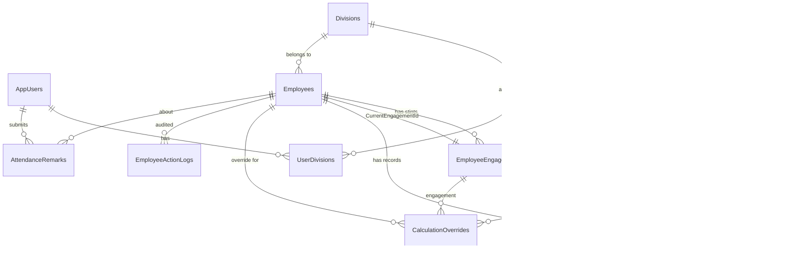

# Attendance Management System — Complete Database Documentation

> **Database**: Oracle 11g  
> **Schema**: `SYSTEM` (application tables) + `HRDATA` (company HR data)  
> **Total Tables**: 18  
> **Auto-increment strategy**: SEQUENCE + BEFORE INSERT TRIGGER (Oracle 11g compatible)

---

## Table of Contents

1. [Entity-Relationship Overview](#1-entity-relationship-overview)
2. [hrdata.empdetails](#2-hrdataempdetails)
3. [AppUsers](#3-appusers)
4. [Divisions](#4-divisions)
5. [Categories](#5-categories)
6. [UserDivisions](#6-userdivisions)
7. [Vendors](#7-vendors)
8. [ContractPeriods](#8-contractperiods)
9. [ContractPeriodVendors](#9-contractperiodvendors)
10. [Employees](#10-employees)
11. [EmployeeEngagements](#11-employeeengagements)
12. [Attendance](#12-attendance)
13. [CalculationWages](#13-calculationwages)
14. [CalculationOverrides](#14-calculationoverrides)
15. [EmployeeActionLogs](#15-employeeactionlogs)
16. [ActionLog](#16-actionlog)
17. [AdminActionLog](#17-adminactionlog)
18. [Attendance_Audit_Log](#18-attendance_audit_log)
19. [AttendanceRemarks](#19-attendanceremarks)
20. [Relationship Quick-Reference Map](#20-relationship-quick-reference-map)

---

## 1. Entity-Relationship Overview



---

## 2. `hrdata.empdetails`

**Schema**: `HRDATA`  
**Purpose**: Stores the official company HR records. This table is the **source of truth for employee names, designations, and divisions** at login time. It is typically maintained by the company's existing HR system. The attendance app reads from it during login to populate the user's session details.

| Column | Type | Nullable | Description |
|---|---|---|---|
| `PCNO` | VARCHAR2(50) | NOT NULL | **Primary Key.** Personnel/Company Number — the unique employee ID issued by the company. This is the same number used as the username in Active Directory login. |
| `NAME` | VARCHAR2(200) | NOT NULL | Full display name of the employee (e.g., "Rajesh Kumar"). |
| `DESIGNATION` | VARCHAR2(100) | YES | Job designation/title (e.g., "Engineer", "Manager", "Technician"). |
| `DIVNAME` | VARCHAR2(100) | YES | Division or department the employee belongs to in the company org structure (e.g., "DKRM/ITISG"). |

**Relationships**:
- **Read by `Login.aspx.cs`** during login: after Active Directory authenticates the user's PCNO, this table is queried to fetch their name, designation, and division for the session.
- **Not directly linked** by a foreign key to application tables — it is an independent HR data store.
- If a PCNO is missing from this table, the login falls back gracefully using the name stored in `AppUsers`.

---

## 3. `AppUsers`

**Schema**: `SYSTEM`  
**Purpose**: The **application's user registry**. Every person who can log into the attendance system must have a row here. It stores their PCNO (same as AD username), display name, and their role (admin or regular user). This table is what the app checks **after** AD authentication succeeds.

| Column | Type | Nullable | Description |
|---|---|---|---|
| `PCNO` | VARCHAR2(50) | NOT NULL | **Primary Key.** Personnel/Company Number — must match the PCNO returned by Active Directory's `EmployeeID` attribute. |
| `Name` | VARCHAR2(200) | NOT NULL | Display name. For admin accounts this is updated automatically at every login from `hrdata.empdetails`. |
| `Role` | NUMBER(1) | NOT NULL | Access level: `1` = Admin (full access), `0` = Regular User (division-restricted access), `2` = Revoked Admin, `3` = Revoked Regular User. Revoked users get an "access denied" message at login. |

**Relationships**:
- `PCNO` is referenced by **`UserDivisions.PCNO`** — every regular user has one or more division mappings.
- `PCNO` is referenced by **`AttendanceRemarks.SubmittedBy`** — tracks who sent each remark.
- Admins are created and managed via the Admin Management page (`AdminManagement.aspx`).

---

## 4. `Divisions`

**Schema**: `SYSTEM`  
**Purpose**: Master list of all **organisational divisions/departments** that exist in the company. This is the reference table for department names used throughout the system. Every employee is assigned to one division, and every regular user is granted access to one or more divisions.

| Column | Type | Nullable | Description |
|---|---|---|---|
| `Id` | NUMBER | NOT NULL | **Primary Key.** Auto-incremented via `SEQ_Divisions` + `TRG_Divisions`. |
| `Name` | VARCHAR2(100) | NOT NULL | **Unique.** Division name (e.g., "D-KRM", "AD-Admin", "CWG"). This value is used as a foreign key in multiple tables. |

**Relationships**:
- Referenced by **`Employees.Department`** — every employee's department must be a valid division name.
- Referenced by **`UserDivisions.DivisionName`** — defines which divisions a user can access.
- Managed by admin via the Settings page (`Settings.aspx`).

**Auto-increment**: `SEQ_Divisions` sequence + `TRG_Divisions` trigger.

---

## 5. `Categories`

**Schema**: `SYSTEM`  
**Purpose**: Master list of **employee skill categories** used for wage calculation and contract grouping. Examples are Skilled, Semi-Skilled, Unskilled. A contract period is always associated with one category, and each employee engagement belongs to a category.

| Column | Type | Nullable | Description |
|---|---|---|---|
| `Id` | NUMBER | NOT NULL | **Primary Key.** Auto-incremented via `SEQ_Categories` + `TRG_Categories`. |
| `Name` | VARCHAR2(100) | NOT NULL | **Unique.** Category name (e.g., "Skilled", "Semi-Skilled", "Unskilled"). Used as FK in `ContractPeriods` and `EmployeeEngagements`. |

**Relationships**:
- Referenced by **`ContractPeriods.Category`** — each contract period is for a specific category.
- Referenced by **`EmployeeEngagements.Category`** — each employment stint is under a specific category.
- Referenced by **`CalculationWages.Category`** — wage rates are set per category per month.
- Referenced by **`CalculationOverrides.Category`** — overrides are per category per employee.
- Managed by admin via the Settings page.

**Auto-increment**: `SEQ_Categories` sequence + `TRG_Categories` trigger.

---

## 6. `UserDivisions`

**Schema**: `SYSTEM`  
**Purpose**: A **many-to-many bridge table** between `AppUsers` and `Divisions`. It defines which divisions a regular user is **allowed to see and manage**. When a regular user logs in, only employees from their allowed divisions are shown on the attendance page and in the send-remark employee list.

| Column | Type | Nullable | Description |
|---|---|---|---|
| `PCNO` | VARCHAR2(50) | NOT NULL | **Part of Composite PK.** FK → `AppUsers.PCNO`. The regular user who is being granted access. |
| `DivisionName` | VARCHAR2(100) | NOT NULL | **Part of Composite PK.** FK → `Divisions.Name`. The division this user is allowed to access. |

**Primary Key**: `(PCNO, DivisionName)` — a user cannot be assigned the same division twice.

**Relationships**:
- `PCNO` → `AppUsers.PCNO`: links to the user account.
- `DivisionName` → `Divisions.Name`: links to a valid division.
- Admins do **not** have rows here — they see all divisions automatically.
- Managed by admin via the Admin Management page.

---

## 7. `Vendors`

**Schema**: `SYSTEM`  
**Purpose**: Stores the **manpower agencies or contractors** who supply workers. Each contract period is associated with a vendor. Vendors can be marked inactive but are never deleted (to preserve historical data integrity).

| Column | Type | Nullable | Description |
|---|---|---|---|
| `Id` | NUMBER | NOT NULL | **Primary Key.** Auto-incremented via `SEQ_Vendors` + `TRG_Vendors`. |
| `MasterId` | VARCHAR2(50) | NOT NULL | **Unique.** Human-readable vendor code (e.g., "VND001"). Used internally as a stable reference. |
| `Name` | VARCHAR2(150) | NOT NULL | **Unique.** Full vendor name (e.g., "Vishal Manpower Services"). |
| `GemId` | VARCHAR2(100) | YES | Government e-Marketplace (GeM) portal ID for the vendor (used in official procurement). |
| `ContactName` | VARCHAR2(100) | YES | Name of the primary contact person at the vendor company. |
| `ContactPhone` | VARCHAR2(20) | YES | Phone number of the vendor contact. |
| `Address` | VARCHAR2(4000) | YES | Full postal address of the vendor. |
| `IsActive` | NUMBER(1) | NOT NULL | `1` = Active vendor, `0` = Inactive/deactivated. Inactive vendors still appear in historical records but cannot be selected for new contracts. |

**Relationships**:
- Referenced by **`ContractPeriods.VendorId`** — a contract period is held by a vendor.
- Referenced by **`ContractPeriodVendors.VendorId`** — vendors can be attached to multiple contract periods.
- Referenced by **`EmployeeEngagements.VendorId`** — records which vendor supplied the employee during a stint.
- Managed via `Vendors.aspx`.

**Auto-increment**: `SEQ_Vendors` sequence + `TRG_Vendors` trigger.

---

## 8. `ContractPeriods`

**Schema**: `SYSTEM`  
**Purpose**: Represents a **formal contract period** — a span of time during which a vendor supplies workers of a specific category under an official contract. This is the highest-level grouping for attendance and payroll. All employees and their attendance records are ultimately tied to a contract period.

| Column | Type | Nullable | Description |
|---|---|---|---|
| `Id` | NUMBER | NOT NULL | **Primary Key.** Auto-incremented via `SEQ_ContractPeriods` + `TRG_ContractPeriods`. |
| `Category` | VARCHAR2(100) | NOT NULL | FK → `Categories.Name`. The skill category this contract covers (e.g., "Skilled"). |
| `VendorId` | NUMBER | NOT NULL | FK → `Vendors.Id`. The primary vendor holding this contract. |
| `StartDate` | DATE | NOT NULL | The date on which this contract period begins. |
| `EndDate` | DATE | YES | The date on which this contract period ends. NULL means the contract is still open/ongoing. |
| `Status` | VARCHAR2(20) | NOT NULL | `'Active'` = currently in force, `'Closed'` = contract has ended. |
| `Notes` | VARCHAR2(4000) | YES | Free-text notes (e.g., contract reference number, special conditions). |

**Unique Constraint**: `(Category, StartDate)` — only one contract per category can start on the same date.

**Relationships**:
- `Category` → `Categories.Name`
- `VendorId` → `Vendors.Id`
- Referenced by **`ContractPeriodVendors.ContractPeriodId`**
- Referenced by **`EmployeeEngagements.ContractPeriodId`** — every employment stint is under a contract.
- Referenced by **`Attendance.ContractPeriodId`** — attendance records carry the contract context.
- Referenced by **`CalculationOverrides.ContractPeriodId`**
- Managed via `Contracts.aspx`.

**Auto-increment**: `SEQ_ContractPeriods` + `TRG_ContractPeriods`.

---

## 9. `ContractPeriodVendors`

**Schema**: `SYSTEM`  
**Purpose**: A **junction table** that lists all vendors participating in a given contract period. While `ContractPeriods` has one primary vendor, a contract can involve multiple vendors (sub-contracting scenarios). This table tracks each vendor's participation and active status within a contract.

| Column | Type | Nullable | Description |
|---|---|---|---|
| `Id` | NUMBER | NOT NULL | **Primary Key.** Auto-incremented via `SEQ_ContractPeriodVendors` + `TRG_ContractPeriodVendors`. |
| `ContractPeriodId` | NUMBER | NOT NULL | FK → `ContractPeriods.Id`. Which contract period this vendor is part of. |
| `VendorId` | NUMBER | NOT NULL | FK → `Vendors.Id`. The vendor participating in this contract. |
| `Category` | VARCHAR2(100) | NOT NULL | The category of workers this vendor is supplying under this contract. |
| `IsActive` | NUMBER(1) | NOT NULL | `1` = vendor is currently active in this contract, `0` = removed/inactive. |

**Relationships**:
- `ContractPeriodId` → `ContractPeriods.Id`
- `VendorId` → `Vendors.Id`

**Auto-increment**: `SEQ_ContractPeriodVendors` + `TRG_ContractPeriodVendors`.

---

## 10. `Employees`

**Schema**: `SYSTEM`  
**Purpose**: The **master employee registry**. Every worker tracked in the attendance system has exactly one row here. An employee's `MasterId` is their permanent unique identifier that never changes, even when they change vendor, category, or division. All attendance records, engagements, and calculation overrides reference this table.

| Column | Type | Nullable | Description |
|---|---|---|---|
| `MasterId` | VARCHAR2(50) | NOT NULL | **Primary Key.** Permanent unique identifier for the employee (e.g., "EMP-0001"). This ID is generated when the employee is first registered and never changes. |
| `ID` | VARCHAR2(50) | NOT NULL | Employee's display ID — may be an official company-assigned ID number. Different from `MasterId`. |
| `Name` | VARCHAR2(200) | NOT NULL | Full name of the employee. |
| `Department` | VARCHAR2(100) | YES | FK → `Divisions.Name`. The division/department this employee currently works in. |
| `Category` | VARCHAR2(50) | YES | Current skill category (e.g., "Skilled"). Denormalized for quick access; the canonical value is in the current engagement. |
| `OriginalJoinDate` | DATE | YES | The very first date the employee joined — preserved even when they leave and rejoin under a new contract. Used for tenure tracking. |
| `JoinDate` | DATE | YES | The start date of the current engagement/contract. This is the date used for attendance date-range validation. |
| `LeaveBalance` | NUMBER | NOT NULL | Current unused paid leave balance (in days). Incremented at month-end, decremented when a paid leave day is recorded. Default `0`. |
| `Status` | VARCHAR2(20) | NOT NULL | Current employment status: `Active`, `Resigned`, `ContractEnded`, `Upgraded`, `Downgraded`. Controls visibility in attendance and reports. |
| `ResignDate` | DATE | YES | Date the employee resigned. Set when status changes to `Resigned`. |
| `ContractEndDate` | DATE | YES | Date the current contract expires. Set when status changes to `ContractEnded`. |
| `CurrentEngagementId` | NUMBER | YES | FK → `EmployeeEngagements.Id`. Points to the employee's most recent/active engagement record. NULL if the employee has no active engagement. |

**Relationships**:
- `Department` → `Divisions.Name`
- `CurrentEngagementId` → `EmployeeEngagements.Id` (circular reference — added via `ALTER TABLE` after engagements table is created)
- Referenced by **`EmployeeEngagements.EmpID`**
- Referenced by **`Attendance.EmpID`**
- Referenced by **`CalculationOverrides.EmpID`**
- Referenced by **`EmployeeActionLogs.EmpMasterId`**
- Referenced by **`AttendanceRemarks.EmpID`**

---

## 11. `EmployeeEngagements`

**Schema**: `SYSTEM`  
**Purpose**: Tracks each **employment stint** of an employee. An employee can have multiple engagements over time — each time they join under a new contract period, a new engagement row is created. The engagement records the exact contract, vendor, category, and date range for that specific stint. This is the core linking table that ties employees to contracts.

| Column | Type | Nullable | Description |
|---|---|---|---|
| `Id` | NUMBER | NOT NULL | **Primary Key.** Auto-incremented via `SEQ_EmployeeEngagements` + `TRG_EmployeeEngagements`. |
| `EmpID` | VARCHAR2(50) | NOT NULL | FK → `Employees.MasterId`. Which employee this engagement belongs to. |
| `ContractPeriodId` | NUMBER | NOT NULL | FK → `ContractPeriods.Id`. Which contract period this employment stint falls under. |
| `Category` | VARCHAR2(100) | NOT NULL | Skill category for this engagement (e.g., "Skilled"). May differ from the employee's current category if they were upgraded/downgraded. |
| `VendorId` | NUMBER | NOT NULL | FK → `Vendors.Id`. The vendor who supplied/manages this employee in this engagement. |
| `Department` | VARCHAR2(100) | YES | Division/department for this specific engagement. May differ from current department if transferred. |
| `StartDate` | DATE | NOT NULL | The date this engagement started (employee joined under this contract). |
| `EndDate` | DATE | YES | The date this engagement ended. NULL means the engagement is still active. |
| `EndReason` | VARCHAR2(50) | YES | Why the engagement ended: `Resigned`, `ContractEnded`, `Upgraded`, `Downgraded`, `CarriedOver`. |
| `IsCarriedOver` | NUMBER(1) | NOT NULL | `1` = this engagement was automatically created when the employee carried over from a previous contract period. `0` = fresh engagement. |
| `PrevEngagementId` | NUMBER | YES | FK → `EmployeeEngagements.Id` (self-referencing). If `IsCarriedOver = 1`, this points to the engagement in the previous contract period that this one continues from. Creates a linked chain of engagements. |
| `EmployeeId` | VARCHAR2(50) | YES | The employee's official ID as assigned in this engagement. May differ from `Employees.ID` in some carry-over scenarios. |

**Relationships**:
- `EmpID` → `Employees.MasterId`
- `ContractPeriodId` → `ContractPeriods.Id`
- `VendorId` → `Vendors.Id`
- `PrevEngagementId` → `EmployeeEngagements.Id` (self-join)
- Referenced by **`Employees.CurrentEngagementId`**
- Referenced by **`Attendance.EngagementId`**
- Referenced by **`CalculationOverrides.EngagementId`**

**Auto-increment**: `SEQ_EmployeeEngagements` + `TRG_EmployeeEngagements`.

---

## 12. `Attendance`

**Schema**: `SYSTEM`  
**Purpose**: The **core table of the entire system** — stores one row per employee per calendar day (within their active period). Every cell the admin fills on the attendance grid is stored here. Each row captures what happened on a specific day for a specific employee: were they present, on leave, on holiday, or absent?

| Column | Type | Nullable | Description |
|---|---|---|---|
| `Id` | NUMBER | NOT NULL | **Primary Key.** Auto-incremented via `SEQ_Attendance` + `TRG_Attendance`. |
| `EmpID` | VARCHAR2(50) | NOT NULL | FK → `Employees.MasterId`. Which employee this record is for. |
| `EngagementId` | NUMBER | YES | FK → `EmployeeEngagements.Id`. Which engagement was active on this day. Populated when the record is saved. |
| `ContractPeriodId` | NUMBER | YES | FK → `ContractPeriods.Id`. Which contract period this attendance day falls under. |
| `Year` | NUMBER(4) | NOT NULL | Calendar year of the attendance record (e.g., 2026). |
| `Month` | NUMBER(2) | NOT NULL | Calendar month 1–12 of the attendance record. |
| `Day` | NUMBER(2) | NOT NULL | Calendar day 1–31 of the attendance record. |
| `StatusValue` | NUMBER(1) | YES | **The attendance value:** `0` = Absent, `1` = Present, `0.5` (stored as a number) = Half-day (if applicable). NULL = not yet filled. |
| `LeaveType` | VARCHAR2(50) | YES | Type of leave if the day is a leave day: `PaidLeave`, `UnpaidLeave`, `SickLeave`, etc. NULL if not a leave day. |
| `IsHoliday` | NUMBER(1) | YES | `1` = this day is a public holiday (marked by admin). `0` = normal working day. |
| `AutoSat` | NUMBER(1) | YES | `1` = this is a Saturday that was automatically counted as absent due to the "2 Saturdays = 1 day deducted" rule. `0` = not an auto-Saturday. |
| `Remarks` | VARCHAR2(500) | YES | Free-text remarks — populated when admin manually overrides a Saturday attendance (right-click edit feature). Shown as a tooltip on the overridden cell. |

**Unique Constraint**: `(EmpID, Year, Month, Day)` — an employee can have at most one attendance record per day.

**Relationships**:
- `EmpID` → `Employees.MasterId`
- `EngagementId` → `EmployeeEngagements.Id`
- `ContractPeriodId` → `ContractPeriods.Id`

**Auto-increment**: `SEQ_Attendance` + `TRG_Attendance`.

---

## 13. `CalculationWages`

**Schema**: `SYSTEM`  
**Purpose**: Stores the **wage rate** (daily rate in currency) for each skill category for a given month and year. The salary calculation page uses this to compute total wages: `WageRate × AttendedDays = TotalWage` for each employee. Admins set these rates before running the month-end calculation.

| Column | Type | Nullable | Description |
|---|---|---|---|
| `Year` | NUMBER(4) | NOT NULL | **Part of Composite PK.** The year this wage rate applies to. |
| `Month` | NUMBER(2) | NOT NULL | **Part of Composite PK.** The month (1–12) this wage rate applies to. |
| `Category` | VARCHAR2(50) | NOT NULL | **Part of Composite PK.** FK → `Categories.Name`. Which skill category this rate applies to. |
| `WageRate` | NUMBER(10,2) | NOT NULL | The daily wage rate in currency for this category in this month (e.g., 650.00). |

**Primary Key**: `(Year, Month, Category)` — one rate per category per month.

**Relationships**:
- `Category` implicitly references `Categories.Name` (no FK constraint, but must match a valid category).
- Read by `Calculation.aspx.cs` when computing monthly payroll.

---

## 14. `CalculationOverrides`

**Schema**: `SYSTEM`  
**Purpose**: Allows admins to **manually override the final number of attended days** used in salary calculation for a specific employee in a specific month. If the calculated attendance count is wrong for any reason, the admin can set a custom `FinalDays` value here which takes priority over the auto-calculated count.

| Column | Type | Nullable | Description |
|---|---|---|---|
| `Year` | NUMBER(4) | NOT NULL | **Part of Composite PK.** The year of the override. |
| `Month` | NUMBER(2) | NOT NULL | **Part of Composite PK.** The month (1–12) of the override. |
| `Category` | VARCHAR2(50) | NOT NULL | **Part of Composite PK.** The category of the employee for this override. |
| `EmpID` | VARCHAR2(50) | NOT NULL | **Part of Composite PK.** FK → `Employees.MasterId`. The employee being overridden. |
| `EngagementId` | NUMBER | YES | FK → `EmployeeEngagements.Id`. The engagement this override applies to. |
| `ContractPeriodId` | NUMBER | YES | FK → `ContractPeriods.Id`. The contract period context. |
| `FinalDays` | NUMBER(3) | YES | The manually set number of days to use for this employee's calculation. Overrides the auto-count from `Attendance`. |

**Primary Key**: `(Year, Month, Category, EmpID)`.

**Relationships**:
- `EmpID` → `Employees.MasterId`
- `EngagementId` → `EmployeeEngagements.Id`
- `ContractPeriodId` → `ContractPeriods.Id`

---

## 15. `EmployeeActionLogs`

**Schema**: `SYSTEM`  
**Purpose**: A detailed **audit trail for every change made to employee records**. Every time an employee is added, edited, resigned, upgraded, downgraded, or their engagement changed, a row is inserted here. The `PreState` and `PostState` columns store JSON snapshots of the employee record before and after the change, enabling a full undo history.

| Column | Type | Nullable | Description |
|---|---|---|---|
| `Id` | NUMBER | NOT NULL | **Primary Key.** Auto-incremented via `SEQ_EmployeeActionLogs` + `TRG_EmployeeActionLogs`. |
| `ActionTime` | TIMESTAMP | NOT NULL | When the action occurred. Defaults to `SYSTIMESTAMP` (current DB time). |
| `ActionType` | VARCHAR2(50) | NOT NULL | Type of change: `ADD`, `EDIT`, `RESIGN`, `UPGRADE`, `DOWNGRADE`, `CONTRACT_END`, `UNDO`, `CARRYOVER`, etc. |
| `EmpMasterId` | VARCHAR2(50) | NOT NULL | The `MasterId` of the employee who was affected. Not a FK constraint (to allow keeping log even if employee record changes). |
| `Description` | VARCHAR2(500) | NOT NULL | Human-readable summary of what changed (e.g., "Changed department from D-KRM to D-Admin"). |
| `PreState` | CLOB | YES | JSON snapshot of the employee record **before** the action. Used to power the Undo feature. |
| `PostState` | CLOB | YES | JSON snapshot of the employee record **after** the action. Used to power the Redo/view history. |
| `IsUndone` | NUMBER(1) | NOT NULL | `1` = this action has been undone via the undo button. `0` = active. Undone records are greyed out in the action log view. |

**Relationships**:
- `EmpMasterId` logically refers to `Employees.MasterId` (no enforced FK).
- Viewed via the Employee page's action log panel.

**Auto-increment**: `SEQ_EmployeeActionLogs` + `TRG_EmployeeActionLogs`.

---

## 16. `ActionLog`

**Schema**: `SYSTEM`  
**Purpose**: A **general-purpose system action log** for tracking non-employee-specific system events. Used for logging things like bulk attendance saves, settings changes, calculation runs, and other admin operations that don't pertain to a single employee.

| Column | Type | Nullable | Description |
|---|---|---|---|
| `Id` | NUMBER | NOT NULL | **Primary Key.** Auto-incremented via `SEQ_ActionLog` + `TRG_ActionLog`. |
| `ActionTime` | TIMESTAMP | NOT NULL | Timestamp of the action. Defaults to `SYSTIMESTAMP`. |
| `ActionType` | VARCHAR2(100) | NOT NULL | Category of the action (e.g., `BULK_ATTENDANCE_SAVE`, `SETTINGS_CHANGE`, `CALC_RUN`). |
| `PerformedBy` | VARCHAR2(100) | YES | PCNO of the admin or user who performed the action. |
| `TargetId` | VARCHAR2(100) | YES | The primary identifier of the entity affected (e.g., contract period ID, employee ID). |
| `Description` | VARCHAR2(1000) | YES | Human-readable description of what happened. |
| `PreState` | CLOB | YES | JSON of the state before the action (if applicable). |
| `PostState` | CLOB | YES | JSON of the state after the action (if applicable). |

**Relationships**: Standalone log table. No FK constraints.

**Auto-increment**: `SEQ_ActionLog` + `TRG_ActionLog`.

---

## 17. `AdminActionLog`

**Schema**: `SYSTEM`  
**Purpose**: An **admin-specific action log** — similar to `ActionLog` but used specifically for actions performed through the admin attendance grid (e.g., saving a month's attendance data, marking bulk holidays). Kept separate from `ActionLog` to allow independent querying of admin attendance grid operations.

| Column | Type | Nullable | Description |
|---|---|---|---|
| `Id` | NUMBER | NOT NULL | **Primary Key.** Auto-incremented via `SEQ_AdminActionLog` + `TRG_AdminActionLog`. |
| `ActionTime` | TIMESTAMP | NOT NULL | When the admin action occurred. Defaults to `SYSTIMESTAMP`. |
| `ActionType` | VARCHAR2(100) | NOT NULL | Type of admin action (e.g., `SAVE_ATTENDANCE`, `MARK_HOLIDAY`). |
| `PerformedBy` | VARCHAR2(100) | YES | PCNO of the admin who performed this action. |
| `TargetId` | VARCHAR2(100) | YES | Reference to the affected resource (e.g., contract period ID or employee ID). |
| `Description` | VARCHAR2(1000) | YES | Description of what was done. |
| `PreState` | CLOB | YES | Previous state as JSON. |
| `PostState` | CLOB | YES | New state as JSON. |

**Relationships**: Standalone log table. No FK constraints.

**Auto-increment**: `SEQ_AdminActionLog` + `TRG_AdminActionLog`.

---

## 18. `Attendance_Audit_Log`

**Schema**: `SYSTEM`  
**Purpose**: Tracks **every individual change to a single attendance cell** — when a specific day's status was changed, what it was before, what it became, and who changed it. This is more granular than `AdminActionLog` — one row per cell edit rather than one row per bulk save. Useful for investigating discrepancies in specific employee attendance on specific dates.

| Column | Type | Nullable | Description |
|---|---|---|---|
| `Id` | NUMBER | NOT NULL | **Primary Key.** Auto-incremented via `SEQ_AttendanceAuditLog` + `TRG_AttendanceAuditLog`. |
| `LogTime` | TIMESTAMP | NOT NULL | Exact timestamp of when this cell was changed. Defaults to `SYSTIMESTAMP`. |
| `EmpID` | VARCHAR2(50) | YES | `MasterId` of the employee whose attendance was changed. |
| `Year` | NUMBER(4) | YES | The year of the attendance cell that was changed. |
| `Month` | NUMBER(2) | YES | The month of the attendance cell that was changed. |
| `Day` | NUMBER(2) | YES | The day of the attendance cell that was changed. |
| `OldValue` | NUMBER(1) | YES | The `StatusValue` before the change (0 = Absent, 1 = Present). |
| `NewValue` | NUMBER(1) | YES | The `StatusValue` after the change. |
| `ChangedBy` | VARCHAR2(100) | YES | PCNO of the admin who made the change. |
| `Reason` | VARCHAR2(500) | YES | Optional reason or note for the change (e.g., "Saturday overtime correction"). |

**Relationships**: References `Attendance` logically via `(EmpID, Year, Month, Day)`, but no FK constraint (to keep the audit log independent of live attendance data).

---

## 19. `AttendanceRemarks`

**Schema**: `SYSTEM`  
**Purpose**: Stores **correction requests and remarks** sent by regular users to the admin. When a regular user notices that an employee's attendance is wrong (e.g., an employee was present but wasn't marked), they submit a remark via the Remarks page. The remark appears in the admin's notification bell and Remarks Inbox. The admin can mark it as read or delete it after reviewing.

| Column | Type | Nullable | Description |
|---|---|---|---|
| `Id` | NUMBER | NOT NULL | **Primary Key.** Auto-incremented via `SEQ_AttendanceRemarks` + `TRG_AttendanceRemarks`. |
| `SubmittedBy` | VARCHAR2(100) | NOT NULL | PCNO of the regular user who sent this remark. Logically → `AppUsers.PCNO`. |
| `SenderName` | VARCHAR2(200) | NOT NULL | Display name of the sender at the time of submission (denormalized to avoid join issues if user account changes). |
| `EmpID` | VARCHAR2(50) | NOT NULL | `MasterId` of the employee this remark is about. Logically → `Employees.MasterId`. |
| `RemarkDate` | DATE | NOT NULL | The specific attendance date the remark refers to (e.g., "2026-06-05" if reporting a missed attendance on that day). Must be within the employee's contract period. |
| `Message` | VARCHAR2(1000) | NOT NULL | The actual remark/request text written by the user (max 1000 characters). |
| `IsRead` | NUMBER(1) | NOT NULL | `0` = unread (new, shown in admin's notification bell badge). `1` = read (admin has viewed it). Default `0`. |
| `CreatedAt` | TIMESTAMP | NOT NULL | When the remark was submitted. Defaults to `SYSTIMESTAMP`. |

**Relationships**:
- `SubmittedBy` logically → `AppUsers.PCNO` (no enforced FK)
- `EmpID` logically → `Employees.MasterId` (no enforced FK — remarks are kept even if employee is deleted)
- Read by `Site.Master.cs` to show the unread count badge on the admin notification bell.
- Managed via `Remarks.aspx` (admin inbox) and `UserRemarks.aspx` (user's sent list).

**Auto-increment**: `SEQ_AttendanceRemarks` + `TRG_AttendanceRemarks`.

---

## 20. Relationship Quick-Reference Map

```
hrdata.empdetails
  └── Read at login → no FK links to app tables
  └── PCNO matches AppUsers.PCNO

AppUsers (PCNO)
  ├── → UserDivisions.PCNO          [1 user : many division permissions]
  └── → AttendanceRemarks.SubmittedBy [1 user : many remarks sent]

Divisions (Name)
  ├── → UserDivisions.DivisionName  [1 division : many users]
  └── → Employees.Department        [1 division : many employees]

Categories (Name)
  ├── → ContractPeriods.Category    [1 category : many contracts]
  ├── → EmployeeEngagements.Category
  ├── → CalculationWages.Category
  └── → CalculationOverrides.Category

Vendors (Id)
  ├── → ContractPeriods.VendorId    [1 vendor : many contracts]
  ├── → ContractPeriodVendors.VendorId
  └── → EmployeeEngagements.VendorId

ContractPeriods (Id)
  ├── → ContractPeriodVendors.ContractPeriodId
  ├── → EmployeeEngagements.ContractPeriodId  [1 contract : many stints]
  ├── → Attendance.ContractPeriodId           [1 contract : many days]
  └── → CalculationOverrides.ContractPeriodId

Employees (MasterId)
  ├── → EmployeeEngagements.EmpID    [1 employee : many stints]
  ├── → Attendance.EmpID             [1 employee : many days]
  ├── → CalculationOverrides.EmpID
  ├── → EmployeeActionLogs.EmpMasterId
  └── → AttendanceRemarks.EmpID

EmployeeEngagements (Id)
  ├── ← Employees.CurrentEngagementId  [current active stint]
  ├── → EmployeeEngagements.PrevEngagementId [chain of stints]
  ├── → Attendance.EngagementId
  └── → CalculationOverrides.EngagementId

Attendance (Id)
  └── Audited by → Attendance_Audit_Log.(EmpID, Year, Month, Day)

AttendanceRemarks (Id)
  └── Drives notification badge on admin's Site.Master navbar
```

---

## Auto-Increment Summary

Every table that uses a numeric primary key uses the **Oracle 11g-compatible** pattern:

```sql
-- Example for any table
CREATE SEQUENCE SEQ_TableName START WITH 1 INCREMENT BY 1 NOCACHE NOCYCLE;

CREATE OR REPLACE TRIGGER TRG_TableName
BEFORE INSERT ON TableName
FOR EACH ROW
BEGIN
    IF :NEW.Id IS NULL THEN
        SELECT SEQ_TableName.NEXTVAL INTO :NEW.Id FROM DUAL;
    END IF;
END;
/
```

> **Note**: `GENERATED ALWAYS AS IDENTITY` is **NOT used** as it requires Oracle 12c+. This project runs on Oracle 11g.

| Table | Sequence | Trigger |
|---|---|---|
| Divisions | SEQ_Divisions | TRG_Divisions |
| Categories | SEQ_Categories | TRG_Categories |
| Vendors | SEQ_Vendors | TRG_Vendors |
| ContractPeriods | SEQ_ContractPeriods | TRG_ContractPeriods |
| ContractPeriodVendors | SEQ_ContractPeriodVendors | TRG_ContractPeriodVendors |
| EmployeeEngagements | SEQ_EmployeeEngagements | TRG_EmployeeEngagements |
| Attendance | SEQ_Attendance | TRG_Attendance |
| EmployeeActionLogs | SEQ_EmployeeActionLogs | TRG_EmployeeActionLogs |
| ActionLog | SEQ_ActionLog | TRG_ActionLog |
| AdminActionLog | SEQ_AdminActionLog | TRG_AdminActionLog |
| Attendance_Audit_Log | SEQ_AttendanceAuditLog | TRG_AttendanceAuditLog |
| AttendanceRemarks | SEQ_AttendanceRemarks | TRG_AttendanceRemarks |
